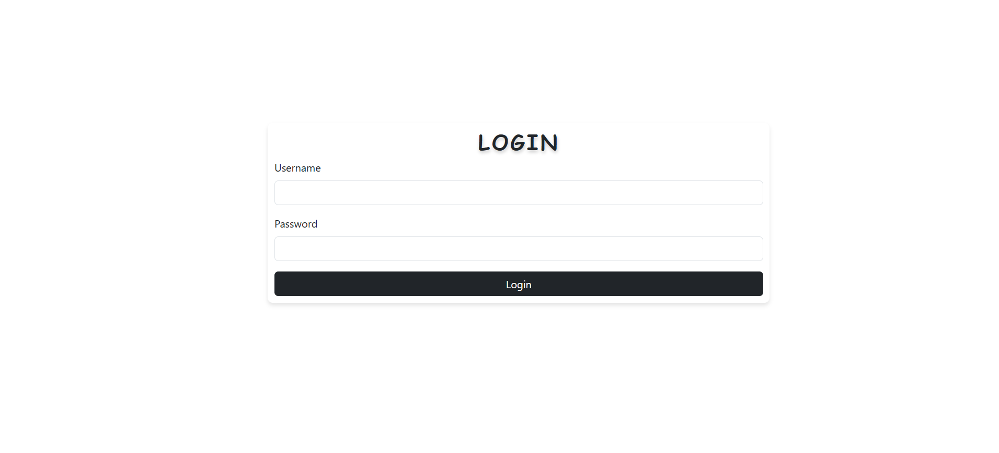
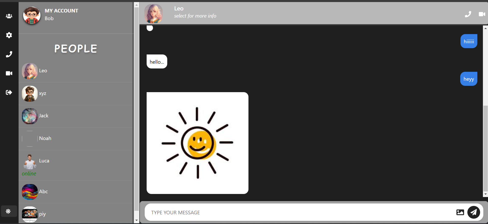

# Real-Time Chat Application with MERN Stack

## Project Overview

This project is a **Real-Time Chat Application** built using the **MERN Stack** (MongoDB, Express, React, Node.js). It features real-time messaging using **Socket.io** for instant communication between users. The application uses **Mongoose** to store user messages and login details, while **Passport.js** is used for authentication. Users can log in, see other online users, send and receive messages, and maintain chat history.

---

## Table of Contents
- [Real-Time Chat Application with MERN Stack](#real-time-chat-application-with-mern-stack)
  - [Project Overview](#project-overview)
  - [Table of Contents](#table-of-contents)
  - [Technologies Used](#technologies-used)
  - [Features](#features)
  - [Installation](#installation)
  - [How It Works](#how-it-works)
- [](#)
- [Screenshots](#screenshots)
    - [Signup page](#signup-page)
    - [Login Page](#login-page)
    - [Home Page (Chat Interface)](#home-page-chat-interface)
    - [Dark Mode](#dark-mode)
- [Future Enhancements](#future-enhancements)
- [License](#license)

---

## Technologies Used
- **Frontend**: React, Socket.io-client
- **Backend**: Node.js, Express.js
- **Database**: MongoDB, Mongoose
- **Authentication**: Passport.js, LocalStrategy
- **Real-time Communication**: Socket.io
- **Session Management**: express-session, connect-mongo
- **Environment Management**: dotenv

---

## Features
- **User Authentication**: Sign up and log in using Passport.js.
- **Real-Time Messaging**: Messages are sent and received instantly with **Socket.io**.
- **Online User Tracking**: Users can see which users are online.
- **Chat History**: Messages are stored in MongoDB using Mongoose, allowing users to access previous chats.
- **Dark Mode**: Toggle between dark and light mode for the chat interface.

---

## Installation

1. **Clone the repository**:

   ```bash
   git clone https://github.com/yourusername/chat-application.git
   cd chat-application

2. Set up the backend:

- Navigate to the backend directory.
- Install dependencies:
  ```bash 
  npm install
- Create a .env file 
  ```bash
  PORT=3000
  MONGO_URL=
  CLOUDINARY_NAME=
  CLOUDINARY_KEY=
  CLOUDINARY_SECRET=

3. Set up the frontend:

- Navigate to the frontend directory.
- Install dependencies:
    ```bash
        npm install

4.  Run the application:

- Start the backend server:
    ```bash  
       npm run dev

- Start the frontend server:
    ```bash
        npm run dev

## How It Works
1. User Registration & Authentication:

- Users can register and log in using their credentials. Authentication is handled via Passport.js using a local strategy.
2. Socket.io Real-Time Communication:

- Once logged in, users can see other online users. Socket.io is used to establish real-time communication between the client and server. Each user is assigned a unique socket ID upon connecting.
3. Message Handling:

- Messages are sent to the server via Socket.io and saved in MongoDB using Mongoose. Messages are then broadcast to the receiver in real-time.

4. File Uploads:

- Users can upload images that are stored on Cloudinary. The image URLs are shared as part of the messages.
  
5.  Interface:

- The chat window dynamically updates as users send and receive messages. The UI supports a dark mode toggle for user customization.
6. Session Management:

- Sessions are managed using express-session and stored in MongoDB via connect-mongo for persistent login states.

#
- Project Structure
    ```bash
    chat-application/
    │
    ├── backend/
    │   ├── models/
    │   │   ├── user.js
    │   │   └── message.js
    │   ├── routers/
    │   │   └── authrouter.js
    │   ├── lib/
    │   │   └── db.js
    │   ├── server.js
    │   ├── .env
    │   └── package.json
    │
    ├── frontend/
    │   ├── components/
    │   │   ├── home/
    │   │   │   ├── LEFTPART.js
    │   │   │   └── RIGHTPART.js
    │   │   └── navbar/
    │   │       └── Navbar.js
    │   ├── App.js
    │   ├── index.js
    │   └── package.json
    │
    └── README.md


- backend/: Contains the Express server, API routes, models, and database connection logic.
- frontend/: Contains the React components for the user interface.
- models/: Defines the Mongoose models for user and message.
- lib/: Contains utility functions like database connection.
- index.js: The entry point for the backend server.

# Screenshots

### Signup page


### Login Page


### Home Page (Chat Interface)


### Dark Mode



# Future Enhancements
- File Sharing: Allow users to send images and other files.
-Group Chats: Implement group chat functionality where multiple users can communicate at once.
-Push Notifications: Notify users when they receive new messages.
- User Profiles: Allow users to customize their profiles with avatars and bio.
  
# License
```bash
    This project is licensed under the MIT License - see the LICENSE file for details.


